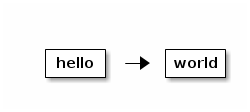

mdx_ditaa
=========

A Python Markdown extension to convert plain-text diagrams to images.

[Ditaa][ditaa] is an Open Source program that converts diagrams drawn
using ASCII art to nice image files. [Python Markdown][pymd] is the
most used implementation of Markdown for Python. It allows for custom
Markdown extensions.
This extension replaces some (labeled) code blocks with the images
generated by `ditaa` program.

How to use
----------

### Installation

Download [mdx_ditaa.py][mdx_ditaa] file, edit `DITAA_CMD` according to
where `ditaa` is installed, and put the file where Python can find it
(like in the current directory).

### Markup

Write your [Ditaa][ditaa] diagrams as fenced code blocks in
[GitHub Flavored Markdown][gfm], and use `ditaa` language identifier:

    ```ditaa

      +-----+     +-----+
      |hello| --> |world|
      +-----+     +-----+

    ```

This extension will call `ditaa` and replace the code block with an
image like this:



### Invocation

Add `"ditaa"` to the list of Markdown extensions when you generate HTML.

    >>> import markdown as md
    >>> source = """Test diagram:
    ...
    ... ```ditaa
    ...
    ...  +---+
    ...  | A |
    ...  +---+
    ...
    ... ```
    ... """
    >>> md.markdown(source, extensions=["ditaa"])
    u'<p>Test diagram:</p>\n<p></p>'

Code block was replaced with an image, a new image file
`diagram-2a5303bc.png` was generated.

On the command line:

    python -m markdown -x ditaa input.md > output.html

This extension assumes that there is a `ditaa` executable on your
`PATH`.  If it is not the case, or you want to override default
`ditaa` parameters, set `DITAA_CMD` environment variable to be the
desired command line to invoke `ditaa`, for example:

    export DITAA_CMD="java -jar /usr/share/java/ditaa/ditaa-0_9.jar {infile} {outfile} --overwrite"

where `{infile}` and `{outfile}` are placeholders for input and output file
names.

Compatiblity: ditaa and fenced_code
-----------------------------------

You may use `ditaa` extension together with `fenced_code` extension;
`ditaa` is supposed to act first.

    >>> import markdown as md
    >>> source = """Test diagram:
    ...
    ... ```ditaa
    ... +---+
    ... | A |
    ... +---+
    ... ```
    ...
    ... Test code:
    ...
    ... ```python
    ... def f():
    ...     pass
    ... ```
    ... """
    >>> md.markdown(source, extensions=["fenced_code", "ditaa"])
    u'<p>Test diagram:</p>\n<p></p>\n<p>Test code:</p>\n<pre><code class="python">def f():\n    pass\n</code></pre>'


Tests
-----

To run doctests:

    python -m doctest README.md


[ditaa]: http://ditaa.sourceforge.net/
[pymd]: http://pythonhosted.org//Markdown/
[gfm]: https://help.github.com/articles/github-flavored-markdown#fenced-code-blocks
[mdx_ditaa]: https://github.com/astanin/py-markdown-ditaa/blob/master/mdx_ditaa.py
